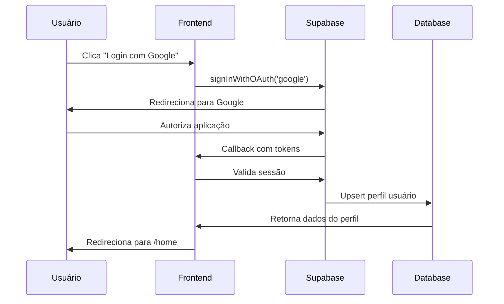

# Arquitetura da Plataforma Premiora

## Visão Geral

A Premiora é uma plataforma SaaS que combina as melhores características do Patreon, Discord, Reddit e YouTube em um ecossistema unificado. Esta documentação detalha a arquitetura técnica da aplicação frontend, focando em escalabilidade, manutenibilidade e experiência do usuário.

## Arquitetura de Alto Nível

### Padrão Arquitetural

A aplicação segue uma arquitetura **Component-Based Architecture** com os seguintes princípios:

- **Separação de Responsabilidades**: Cada componente tem uma responsabilidade única e bem definida
- **Composição sobre Herança**: Utiliza composição de componentes para reutilização
- **Estado Centralizado**: Gerenciamento de estado global através de Context API
- **Roteamento Declarativo**: Navegação baseada em rotas com proteção automática

### Fluxo de Dados

```
┌─────────────────┐    ┌─────────────────┐    ┌─────────────────┐
│   User Interface │───▶│  Event Handlers │───▶│  State Updates  │
│   (Components)   │    │   (Hooks)       │    │   (Context)     │
└─────────────────┘    └─────────────────┘    └─────────────────┘
         │                       │                       │
         ▼                       ▼                       ▼
┌─────────────────┐    ┌─────────────────┐    ┌─────────────────┐
│   Data Fetching │◀───│   API Calls     │◀───│   Supabase       │
│   (Services)    │    │   (Utils)       │    │   (Backend)      │
└─────────────────┘    └─────────────────┘    └─────────────────┘
```

## Arquitetura de Componentes

### Estrutura Hierárquica

```
App (Root)
├── AuthProvider (Context Provider)
│   └── BrowserRouter (Routing)
│       ├── Public Routes
│       │   ├── LandingPage
│       │   │   ├── Header
│       │   │   ├── Hero
│       │   │   ├── Features
│       │   │   ├── Testimonials
│       │   │   ├── Pricing
│       │   │   ├── FAQ
│       │   │   ├── CTA
│       │   │   └── Footer
│       │   └── LoginPage
│       │       └── LoginForm
│       └── Protected Routes
│           └── HomePage
│               ├── Navbar
│               ├── Sidebar
│               ├── Feed
│               │   └── ContentCard[]
│               └── Modals[]
│                   ├── CreatePostModal
│                   ├── CreateVideoModal
│                   ├── CreateCommunityModal
│                   └── CreateContentModal
```

### Tipos de Componentes

#### 1. **Componentes de Página (Pages)**

- **Responsabilidade**: Renderizam layouts completos de páginas
- **Localização**: `src/pages/`
- **Características**:
  - Importam múltiplos componentes menores
  - Gerenciam layout geral da página
  - Conectam-se diretamente com roteamento

#### 2. **Componentes de Layout (Layout)**

- **Responsabilidade**: Estrutura visual e navegação
- **Localização**: `src/components/layout/`
- **Características**:
  - Header, Sidebar, Navbar
  - Estrutura consistente entre páginas
  - Responsivos e adaptáveis

#### 3. **Componentes de Conteúdo (Content)**

- **Responsabilidade**: Exibição de dados do usuário
- **Localização**: `src/components/content/`
- **Características**:
  - ContentCard, Feed
  - Recebem dados via props
  - Focados em apresentação

#### 4. **Componentes de Formulário (Forms)**

- **Responsabilidade**: Coleta e validação de dados
- **Localização**: `src/components/forms/`
- **Características**:
  - Validação de entrada
  - Estados de loading
  - Tratamento de erros

#### 5. **Componentes Modais (Modals)**

- **Responsabilidade**: Interações complexas em overlay
- **Localização**: `src/components/modals/`
- **Características**:
  - Estados independentes
  - Portais para renderização
  - Gerenciamento de foco

#### 6. **Componentes Comuns (Common)**

- **Responsabilidade**: Utilitários reutilizáveis
- **Localização**: `src/components/common/`
- **Características**:
  - ErrorBoundary, FileUpload
  - Altamente reutilizáveis
  - Abstraem funcionalidades comuns

#### 7. **Componentes de Autenticação (Auth)**

- **Responsabilidade**: Controle de acesso e proteção de rotas
- **Localização**: `src/components/auth/`
- **Características**:
  - ProtectedRoute, PublicRoute
  - Redirecionamentos automáticos
  - Verificação de estado de autenticação

## Gerenciamento de Estado

### Context API Architecture

#### AuthContext

```typescript
interface AuthContextType {
  user: User | null;
  userProfile: UserProfile | null;
  session: Session | null;
  signInWithGoogle: () => Promise<void>;
  signInWithFacebook: () => Promise<void>;
  signInWithEmail: (email: string, password: string) => Promise<void>;
  signUpWithEmail: (email: string, password: string) => Promise<void>;
  signOut: () => Promise<void>;
  loading: boolean;
  refreshUserProfile: () => Promise<void>;
}
```

**Características**:

- **Estado Global**: Gerencia autenticação em toda a aplicação
- **Persistência**: Sessões mantidas entre reloads
- **Sincronização**: Perfil do usuário sincronizado com Supabase
- **Reatividade**: Componentes reagem automaticamente a mudanças

### Padrão de Estado Local

#### useState para Estado Componente

- **Uso**: Estados temporários e específicos do componente
- **Exemplos**: Formulários, modais, loading states
- **Vantagens**: Simples, performático para casos locais

#### useReducer para Estado Complexo

- **Uso**: Estados com múltiplas transições relacionadas
- **Exemplos**: Wizards multi-etapa, formulários complexos
- **Vantagens**: Previsível, fácil de testar

## Sistema de Roteamento

### Configuração de Rotas

```typescript
// src/App.tsx
const App: React.FC = () => {
  return (
    <Routes>
      <Route path="/" element={<PublicRoute><LandingPage /></PublicRoute>} />
      <Route path="/login" element={<PublicRoute><Login /></PublicRoute>} />
      <Route path="/home" element={<ProtectedRoute><HomePage /></ProtectedRoute>} />
      <Route path="*" element={<Navigate to="/" replace />} />
    </Routes>
  );
};
```

### Estratégia de Proteção de Rotas

#### PublicRoute

- **Permite acesso**: Apenas usuários não autenticados
- **Redirecionamento**: Usuários logados → `/home`
- **Uso**: Landing page, página de login

#### ProtectedRoute

- **Permite acesso**: Apenas usuários autenticados
- **Redirecionamento**: Usuários não logados → `/login`
- **Uso**: Dashboard, páginas do usuário

## Integração com Supabase

### Arquitetura de Autenticação

#### Provedores OAuth

- **Google OAuth**: Login com contas Google
- **Facebook OAuth**: Login com contas Facebook
- **Email/Senha**: Autenticação tradicional

#### Fluxo de Autenticação



### Gerenciamento de Sessões

#### Estratégia de Sessão

- **Persistência**: Sessões mantidas em localStorage
- **Renovação**: Tokens renovados automaticamente
- **Sincronização**: Estado sincronizado entre abas

#### Perfil do Usuário

```sql
-- Estrutura da tabela users
CREATE TABLE users (
  id UUID PRIMARY KEY REFERENCES auth.users(id),
  email TEXT UNIQUE NOT NULL,
  name TEXT,
  avatar_url TEXT,
  created_at TIMESTAMP DEFAULT NOW(),
  updated_at TIMESTAMP DEFAULT NOW()
);
```

## Arquitetura de Build e Deploy

### Ferramentas de Build

#### Vite

- **Build Tool**: Desenvolvimento e produção
- **Hot Module Replacement**: Recarregamento instantâneo
- **Tree Shaking**: Eliminação de código não utilizado
- **Code Splitting**: Carregamento sob demanda

#### TypeScript

- **Type Checking**: Verificação estática de tipos
- **IntelliSense**: Autocompletar e documentação
- **Refactoring**: Renomeação segura de código

### Pipeline CI/CD

#### GitHub Actions Workflow

```yaml
name: CI Build
on:
  push:
    branches: [main]
  pull_request:
    branches: [main]

jobs:
  build:
    runs-on: ubuntu-latest
    steps:
      - name: Checkout
        uses: actions/checkout@v4
      - name: Setup Node.js
        uses: actions/setup-node@v4
        with:
          node-version: "18"
      - name: Install dependencies
        run: npm ci --prefix premiora-web
      - name: Build
        run: npm run build --prefix premiora-web
```

### Estratégia de Deploy

#### Build de Produção

- **Otimização**: Minificação e compressão
- **Asset Optimization**: Imagens e fontes otimizadas
- **Caching**: Headers apropriados para cache

#### Ambiente de Staging

- **Pré-produção**: Testes em ambiente similar à produção
- **Feature Flags**: Controle de funcionalidades
- **Rollback**: Capacidade de voltar versões

## Padrões de Design Implementados

### Custom Hooks

#### useAuth Hook

```typescript
// src/hooks/useAuth.ts
export const useAuth = () => {
  const context = useContext(AuthContext);
  if (!context) {
    throw new Error("useAuth must be used within AuthProvider");
  }
  return context;
};
```

**Benefícios**:

- **Reutilização**: Lógica compartilhada entre componentes
- **Separação**: Lógica isolada da UI
- **Testabilidade**: Fácil de testar isoladamente

### Error Boundaries

#### ErrorBoundary Component

```typescript
// src/components/common/ErrorBoundary.tsx
class ErrorBoundary extends Component {
  state = { hasError: false };

  static getDerivedStateFromError(error: Error) {
    return { hasError: true };
  }

  componentDidCatch(error: Error, errorInfo: ErrorInfo) {
    console.error('Error caught by boundary:', error, errorInfo);
  }

  render() {
    if (this.state.hasError) {
      return <ErrorFallback />;
    }
    return this.props.children;
  }
}
```

**Responsabilidades**:

- **Captura de Erros**: Previne crashes da aplicação
- **Fallback UI**: Interface amigável para erros
- **Logging**: Registro de erros para debugging

### File Upload Architecture

#### FileUpload Component

```typescript
interface FileUploadProps {
  accept: string;
  maxSize: number;
  onFileSelect: (file: File) => void;
  onError: (error: string) => void;
}
```

**Características**:

- **Validação**: Tipo e tamanho de arquivo
- **Preview**: Visualização antes do upload
- **Progress**: Indicador de progresso
- **Drag & Drop**: Interface intuitiva

## Segurança

### Autenticação e Autorização

#### Row Level Security (RLS)

- **Supabase RLS**: Controle de acesso a nível de linha
- **Políticas**: Regras de segurança no banco de dados
- **JWT Tokens**: Tokens seguros para API calls

#### Proteção de Rotas

- **Client-side Guards**: Verificação antes da renderização
- **Server-side Validation**: Validação no backend
- **Session Management**: Gerenciamento seguro de sessões

### Segurança de Dados

#### Sanitização de Input

- **XSS Prevention**: Sanitização de dados do usuário
- **SQL Injection**: Prepared statements no Supabase
- **CSRF Protection**: Tokens anti-falsificação

#### HTTPS Only

- **SSL/TLS**: Comunicação criptografada
- **Secure Cookies**: Cookies seguros quando aplicável
- **HSTS**: Strict Transport Security

## Performance

### Otimizações Implementadas

#### Code Splitting

```typescript
// Lazy loading de páginas
const HomePage = lazy(() => import('./pages/HomePage'));
const LoginPage = lazy(() => import('./pages/Login'));

// Suspense boundaries
<Suspense fallback={<LoadingSpinner />}>
  <Routes>...</Routes>
</Suspense>
```

#### Bundle Analysis

- **Tree Shaking**: Remoção de código não utilizado
- **Dynamic Imports**: Carregamento sob demanda
- **Vendor Splitting**: Separação de bibliotecas

#### Image Optimization

- **Responsive Images**: Diferentes tamanhos por dispositivo
- **Lazy Loading**: Carregamento progressivo
- **WebP Format**: Formato otimizado quando suportado

### Monitoramento de Performance

#### Web Vitals

- **Core Web Vitals**: Métricas essenciais do Google
- **Lighthouse**: Auditoria automática de performance
- **Real User Monitoring**: Métricas reais dos usuários

## Escalabilidade

### Arquitetura Modular

#### Component Library

- **Atomic Design**: Componentes pequenos e compostos
- **Design System**: Consistência visual e comportamental
- **Theme Support**: Suporte a múltiplos temas

#### Feature Modules

```
src/
├── features/
│   ├── auth/
│   │   ├── components/
│   │   ├── hooks/
│   │   ├── utils/
│   │   └── types/
│   ├── content/
│   └── communities/
```

### Estratégia de Cache

#### Browser Cache

- **Service Worker**: Cache offline
- **HTTP Cache**: Headers apropriados
- **Local Storage**: Dados persistentes

#### API Cache

- **React Query**: Cache inteligente de dados
- **Optimistic Updates**: Atualizações instantâneas
- **Background Sync**: Sincronização em background

## Testabilidade

### Estratégia de Testes

#### Unit Tests

- **Componentes**: Testes de lógica isolada
- **Hooks**: Testes de custom hooks
- **Utils**: Funções utilitárias

#### Integration Tests

- **User Flows**: Fluxos completos do usuário
- **API Integration**: Testes com Supabase
- **Routing**: Navegação e proteção de rotas

#### E2E Tests

- **Critical Paths**: Funcionalidades críticas
- **Cross-browser**: Compatibilidade de navegadores
- **Mobile**: Testes em dispositivos móveis

### Ferramentas de Teste

#### Testing Library

```typescript
// Exemplo de teste de componente
test('login form submits correctly', async () => {
  render(<LoginForm />, { wrapper: AuthProvider });
  const emailInput = screen.getByLabelText(/email/i);
  const submitButton = screen.getByRole('button', { name: /login/i });

  await userEvent.type(emailInput, 'user@example.com');
  await userEvent.click(submitButton);

  await waitFor(() => {
    expect(mockSignIn).toHaveBeenCalledWith('user@example.com', 'password');
  });
});
```

## Monitoramento e Observabilidade

### Logging Strategy

#### Error Logging

- **Client-side**: Captura de erros JavaScript
- **API Errors**: Logging de falhas de API
- **User Actions**: Tracking de interações importantes

#### Analytics

- **User Behavior**: Análise de uso da plataforma
- **Performance Metrics**: Métricas de performance
- **Conversion Funnels**: Funis de conversão

### Alerting

#### Error Alerts

- **Critical Errors**: Notificações imediatas
- **Performance Degradation**: Alertas de performance
- **Security Issues**: Monitoramento de segurança

## Conclusão

A arquitetura da Premiora foi projetada com foco em:

- **Escalabilidade**: Componentes modulares e reutilizáveis
- **Manutenibilidade**: Código bem estruturado e documentado
- **Performance**: Otimizações de build e runtime
- **Segurança**: Autenticação robusta e proteção de dados
- **Experiência do Usuário**: Interface responsiva e intuitiva

Esta arquitetura suporta o crescimento da plataforma de um MVP para uma solução enterprise, mantendo a agilidade necessária para iteração rápida baseada em feedback dos usuários.
